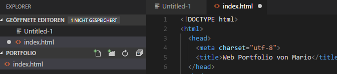

+++
title = "CSS"
date = "2020-11-11"
draft = false
pinned = false
image = "unbenannt.png"
+++
Es geht wieder weiter mit dem Programmieren.

Heute werden wir wieder die ersten zwei Lektionen für das Programmieren verwenden. Wir befinden uns im Moment beim dritten Teil. 

Für mich stellt das Programmieren immer noch ein paar Schwierigkeiten dar. Es ist nicht einfach zu dem ganzen Schulstress noch das Programmieren zu erlernen. 

Es ist sehr anstrengend und erfordert auch viel Konzentration und viel Fleiss. 

