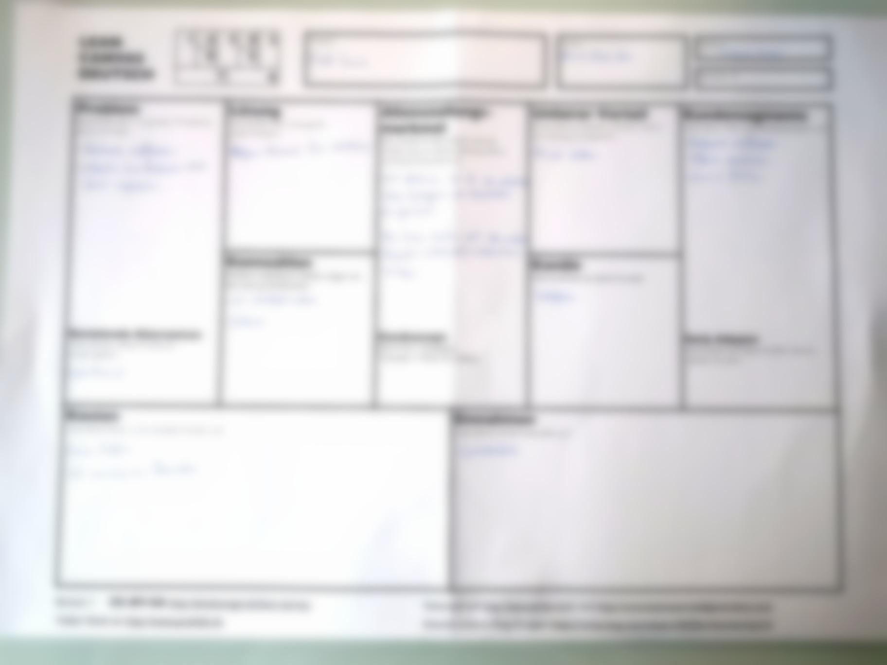

+++
title = "Interaktionen mit den Kunden"
date = "2021-02-03"
draft = false
pinned = false
image = "microsoftteams-image.png"
+++
Am 3. Februar dürfen wir von zuhause aus arbeiten. Wir sind gerade dabei unser neues Projekt auf die Beine zu stellen. Dazu mussten wir zuerst die **CANVAS-Vorlage** ausfüllen. Wir füllten diese alle einzeln aus und tauschten uns dann gegenseitig aus. Dann erkundigten wir uns, wie man bei unserem neuen Projekt vorgeht.\
\
**Neues Projekt:**\
\
Wir trafen uns in den letzten zwei Wochen mit einem Spieler vom Fussballclub Zollikofen und stellten ihm unsere Webseite aus dem ersten Semester vor. Diese konnte aber den Wunsch unseres Kunden nicht komplett erfüllen, da der Fussballclub eher an einem Promoting interessiert wäre. Also haben wir uns darauf geeinigt, dass wir im zweiten Semester im WEB einen Instagramm-Account erstellen und gemeinsam führen. \
\
Da im Moment aufgrund von Corona nicht gespielt wird, ist es die perfekte Gelegenheit für uns, erste Schritte zu wagen. Wir wollen eine gute Basis aufbauen, um später während der Saison gut darauf aufbauen zu können.

