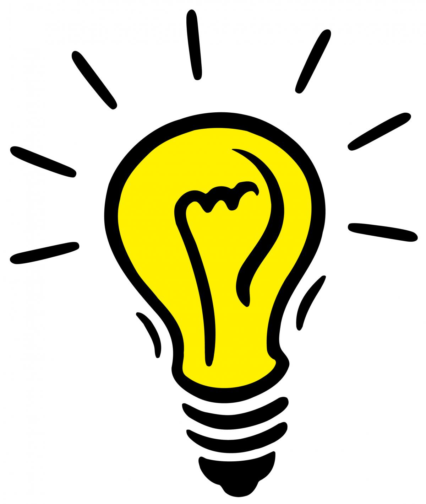

+++
title = "Keine Ideen? Wir helfen"
date = "2020-08-26"
draft = false
pinned = false
image = "idea-light-bulb-clip-art-black-and-white-mtlenkbta.jpg"
+++
Wir haben uns im Dreier Team zusammengesetzt und überlegt mit welcher Idee wir unser Projekt aufbauen. Der Auftrag bestand darin, dass wir auf die Strasse gehen sollten und Personen fragen sollen, was Sie im Moment gerade stört. Was fehlt Ihnen?  Welche Bedürfnisse sind noch nicht gedeckt? Was könnte man verbessern? Lauter solcher Fragen haben wir uns und den Passanten gestellt. 

Unsere Ideen:

* Sportevents
* Sportwetten
* Digitaler Schulstoff
* Platform mit Lösungen

Wir konzentrieren uns für die nächsten Wochen auf zwei gennante Ideen.

