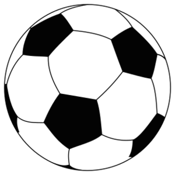

+++
title = "Projekt FirstTouch"
date = "2020-09-02"
draft = false
pinned = false
image = "football-3471402_960_720.jpg"
+++
Wir haben mit der Lehrkraft besprochen, welche zwei Themen wir definitiv umsetzen wollen. An erster Stelle steht das Projekt: **FirstTouch**

An zweiter Stelle: Digital School

Primär geht es aber darum FirstTouch zu verfolgen und weiter zu entwickeln. Wir haben immer wie mehr Ideen und Vorstellungen, wie wir unsere Website gestalten wollen. 

Plannung: Wir haben miteinander abgemacht, dass wir die Websiten, welche uns zu Verfügung stehen, alle am Wochenende genau anschauen und dann gemeinsam entscheiden, mit welcher Website FristTouch machen wollen. Wir planen für die Analyse der verschiedenen Websiten ca. 1h. Für die Besprechung planen wir ungefähr 0,5 bis 1h ein.

Nächste Woche werden wir dann mit dem Erstellen der Website anfangen. 

> 
>
> 
>
> 