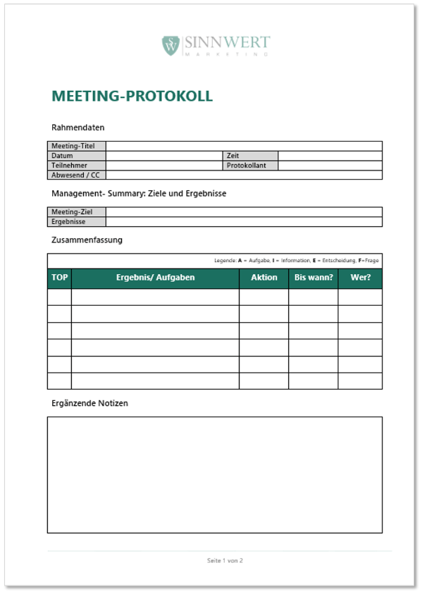

+++
title = "Protokoll"
date = "2020-09-09"
draft = false
pinned = false
image = "protokoll_schreiben_fotolia_66701911_subscription_xxl_butch_website-365x243.jpg"
+++
Wie erstellt man ein Protokoll?

* Datum/Zeit
* Anwesend/Abwesend -> Protokollführer
* Ort
* Zu besprechende Punkte (Traktanden) 

  * Unterschrift

Dies sind die wichtigsten Punkte für ein Protokoll. 

