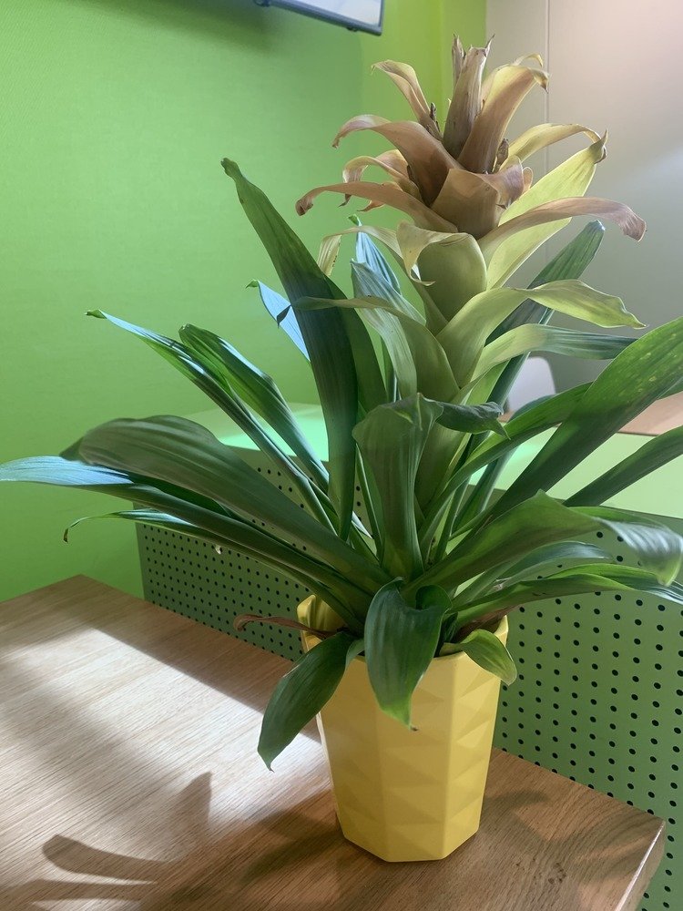

+++
title = "Website erstellen"
date = "2020-08-19"
draft = false
pinned = false
image = "microsoftteams-image-3-2-.jpg"
+++
Heute habe ich gelernt, wie ich eine Internetseite erstelle. Es war sehr spannend und informativ. Am Anfang wurde mir zuerst erklärt, wie ich alles zu bedienen habe. Danach gingen wir in einem 2er Team los, um Blumenfotos für unsere Website zu machen. Nach ein paar coolen Aufnahmen haben wir uns in das Programm reingetastet und die erste provisorische Website erstellt. 

